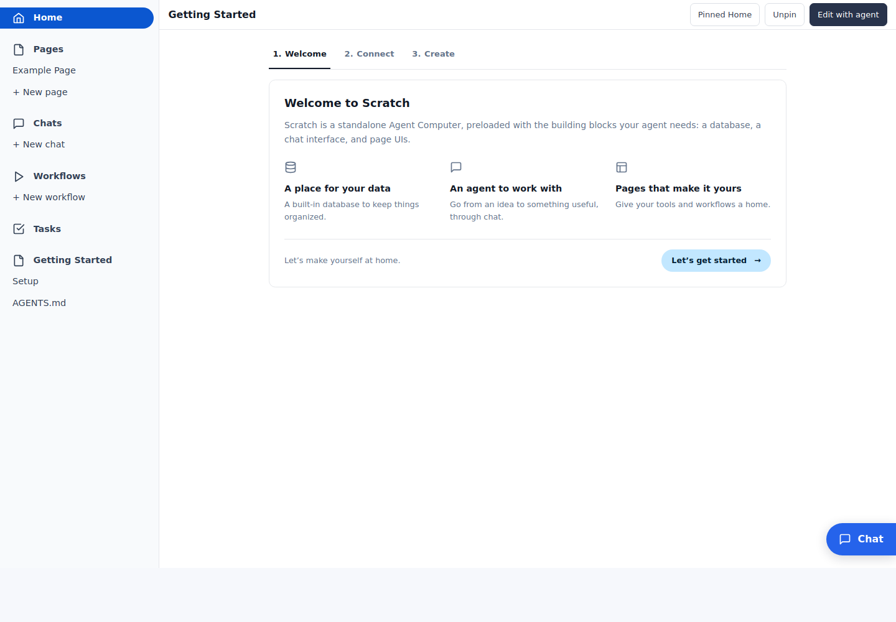

# Scratch experience preview

This branch packages the shared Scratch workspace experience for new users: guided setup, pages, persistent sidebar chats, mobile navigation, tasks, and durable workflows with schedules and run audits.

It includes an Example Page and a paused Example greeting workflow. Personal dashboards, integrations, account settings, data, and schedules are excluded.



This is a preview of the workspace implementation, which evolved separately from current `main`. It is not a merge-ready update to all of main's newer features (including its contacts CRM and workflow engine). Start with a fresh data directory; the preview's migrations are not compatible with an existing main database.

## Try this branch

Install Git and Go 1.26.3 or newer, then check out the preview branch:

```sh
git clone --branch fix/workflows-composer https://github.com/housecat-inc/scratch.git scratch-preview
cd scratch-preview
go tool mage generate
go build -o tmp/scratch-preview ./cmd/scratch
./tmp/scratch-preview --agent echo --data-dir ./tmp/preview-data --port 8889
```

Open [Scratch on localhost](http://localhost:8889). The echo agent lets you test chat, navigation, and the example workflow without a subscription. It repeats messages; it cannot build pages or workflows. Use **Getting Started → Connect** to connect an agent, then restart the preview with `--agent auto` to build with it.

Run the executable from the checkout you want the agent to work in. `--data-dir` isolates the application database and workflow history; agent credentials still use the normal provider configuration for your account. Use the same data directory to keep your preview work across restarts. Stop the foreground process with Ctrl+C.

## Explore the full experience

- **Getting Started:** move through Welcome, Connect, and Create; return to Setup whenever needed.
- **Pages:** open Example Page, pin or unpin it, set it as Home, and open Edit with agent. New page gathers a brief and starts an agent build conversation.
- **Chats:** send messages, attach files, inspect a page section, switch conversations, collapse and reopen the sidebar, and check that drafts survive navigation.
- **Workflows:** open Example greeting, choose Run now, inspect its results and recorded step audit, then try Resume and Pause. It starts paused and performs no network calls or external writes. New workflow starts an agent build conversation from your brief.
- **Tasks:** create and manage tasks. The Contact intake workflow offers a durable review form and creates a follow-up task after acceptance.
- **Mobile:** use the Menu, Work, and Chat controls at narrow viewport sizes.

The page and workflow wizards collect build instructions; a connected coding agent implements the requested functionality. They do not automatically turn a brief into a finished app.

## Development

```sh
go tool mage generate
go test ./pkg/... ./cmd/... ./uikit/... ./testkit/...
go build -o tmp/scratch-preview ./cmd/scratch
```

Browser tests launch headless Chromium using Rod. Code generation produces ignored templ and SQL files and the committed OpenAPI contract. `go tool mage build` installs the executable into your Go bin directory. For a Scratch process hosted by a user systemd service, set `SCRATCH_SERVICE` to that service's name to enable the pending-update restart button.

See [How to build workflows](docs/workflows.md) for registration, durable steps, schedules, summary columns, human review, and recovery.
