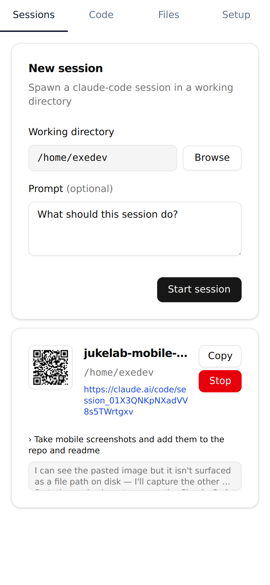
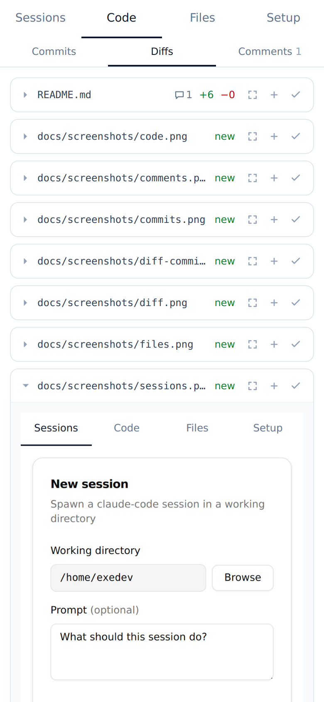
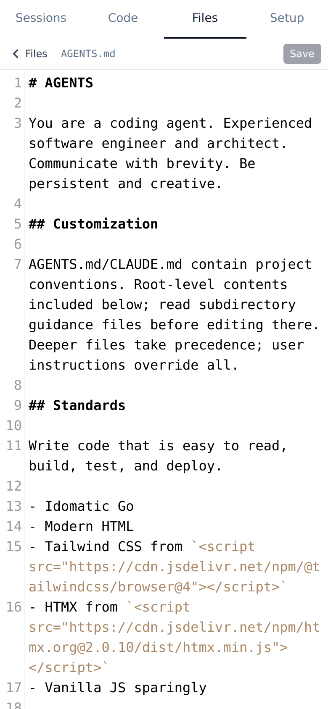
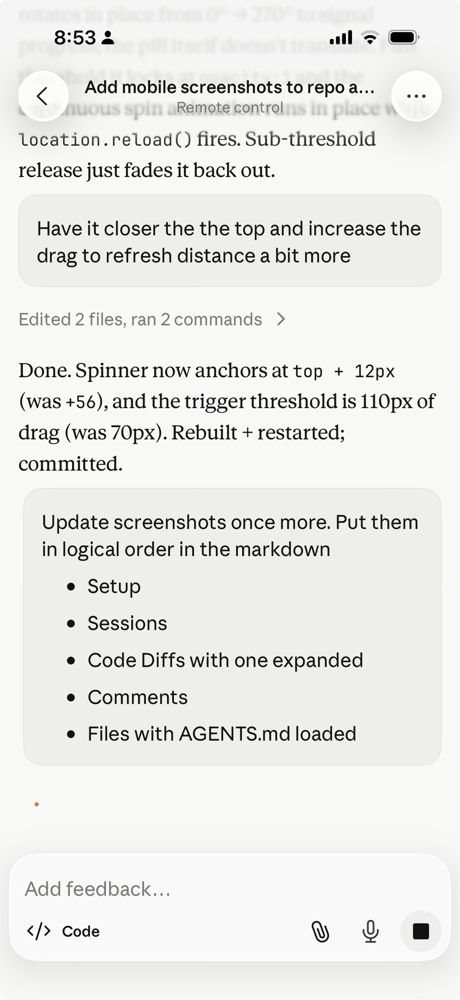

# Setup for Agent Computers

<p align="center">
  
  
  
  
  
  
</p>

## Features

- Claude Code Remote Control setup
- Agent skills management
- Code review and comments
- Claude Desktop and Mobile integration

## Install

```sh
curl -fsSL https://raw.githubusercontent.com/housecat-inc/scratch/main/install.sh | sh
```

## claude-control

Web UI on `:8888` that walks through installing `claude`, removing interactive defaults, and connecting a subscription.

```sh
claude-control --port 8888
```
