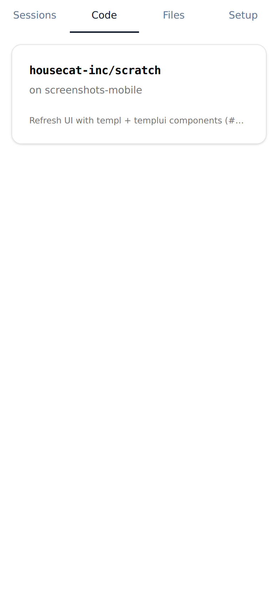
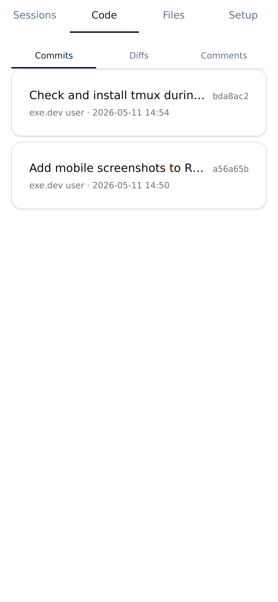

# scratch

Setup for Agent Computers

## Install

```sh
curl -fsSL https://raw.githubusercontent.com/housecat-inc/scratch/main/install.sh | sh
```

## claude-control

Web UI on `:8888` that walks through installing `claude`, removing interactive defaults, and connecting a subscription.

```sh
claude-control --port 8888
```

| Sessions | Setup | Code |
| --- | --- | --- |
|  |  |  |
| **Files** | **Commits** | **Diffs** |
|  |  |  |
