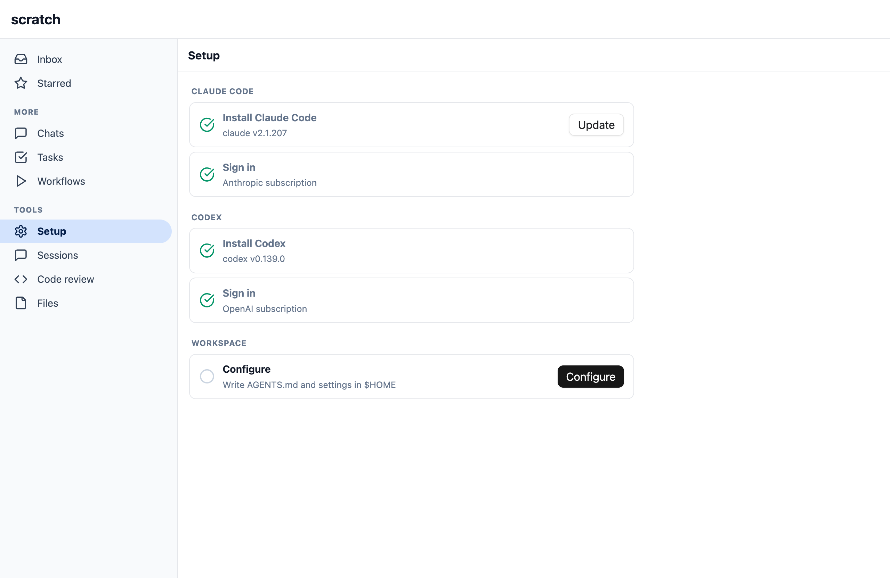
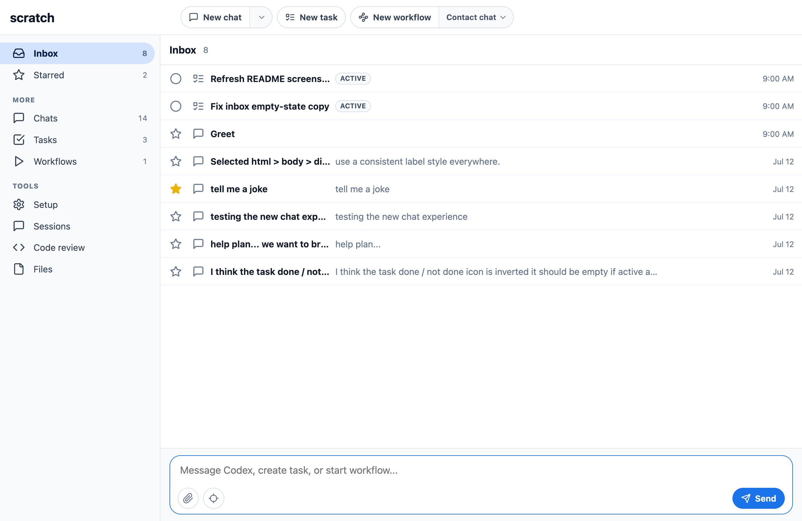
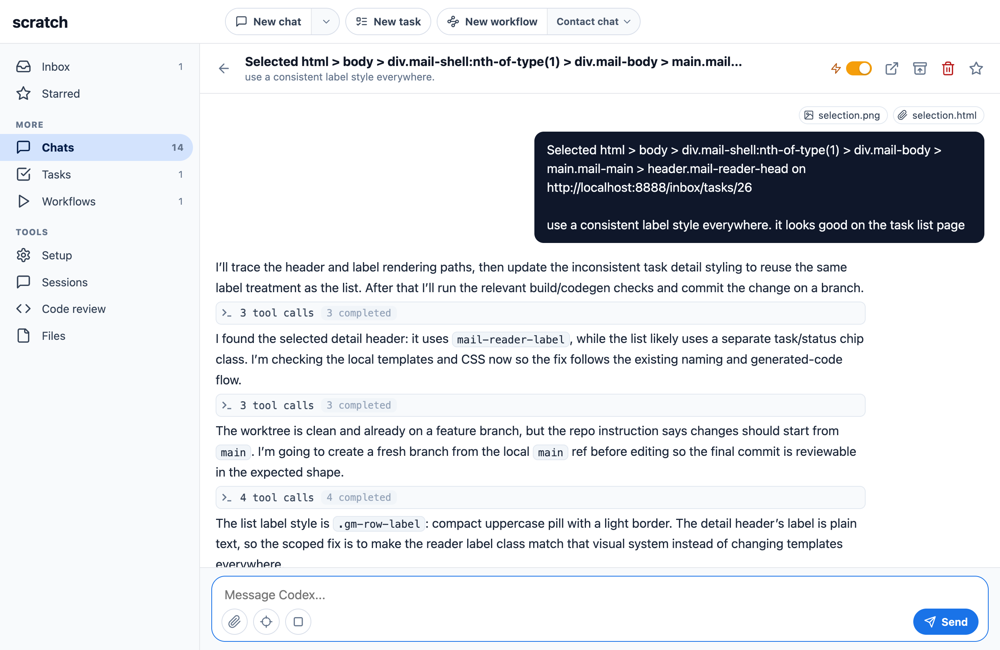
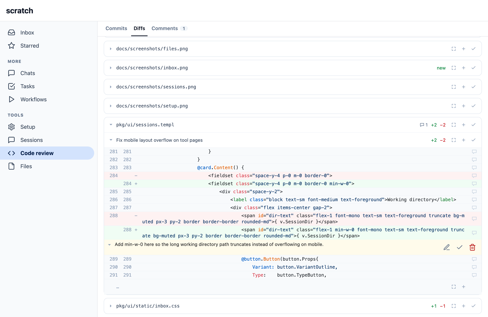

# Setup for Agent Computers

scratch is scaffolding for a new app built with agents. 

First bootstrap Claude Code or OpenAI Codex tools and subscriptions if needed.

Next build CRUD apps with "batteries included" for database, migrations, design system, UI / API / CLI, unit and headless browser integration tests.

Finally iterate with in-app developer tools like a DOM and web inspector agent chat and code review.

## Features

- Agent inbox for chats, tasks, and workflows
- Agent skills management
- Claude Code Remote Control setup
- Claude Desktop and Mobile integration
- Code review and comments
- In-app agent chat with a DOM inspector

<p align="center">
  
  
  
  
</p>

## Install

```sh
curl -fsSL https://raw.githubusercontent.com/housecat-inc/scratch/main/install.sh | sh
```

## scratch

Web UI on `:8888` that walks through installing `claude`, removing interactive defaults, and connecting a subscription.

```sh
scratch --port 8888
```
